# PAKDD2022
26th Pacific-Asia Conference on Knowledge Discovery and Data Mining (PAKDD2022), which will be held in Chengdu, China on May 16-19, 2022.

# Pneumonia Detection using Deep Learning & explaination using LIME

## Problem Statement

**Build a binary classifier to detect pneumonia using chest x-rays.**

### Pneumonia
> Pneumonia is an infection that inflames the air sacs in one or both lungs. The air sacs may fill with fluid or pus (purulent material), causing cough with phlegm or pus, fever, chills, and difficulty breathing. A variety of organisms, including bacteria, viruses and fungi, can cause pneumonia.  Chest X-ray, blood tests, and culture of the sputum may help confirm the diagnosis. The disease may be classified by where it was acquired, such as community- or hospital-acquired or healthcare-associated pneumonia.

## Dataset description

> The dataset will be organized into 3 folders (train, test, val) and contains subfolders for each image category (Pneumonia/Normal). 
> There will be 301(Pneumonia) + 301(No finding) Training X-Ray images (JPEG) and 101(Pneumonia) + 101(No Finding) Test X-Ray images used in this project. 
> Only 2 categories (Pneumonia/Normal) will be covered for VinDr-CXR.
> Chest X-ray images (anterior-posterior) were selected from. In this work, VinDr Research Group describe a dataset of more than 100,000 chest X-ray scans that were retrospectively collected from two major hospitals in Vietnam. Out of this raw data, we release 18,000 images that were manually annotated by a total of 17 experienced radiologists with 22 local labels of rectangles surrounding abnormalities and 6 global labels of suspected diseases. The released dataset is divided into a training set of 15,000 and a test set of 3,000. Each scan in the training set was independently labeled by 3 radiologists, while each scan in the test set was labeled by the consensus of 5 radiologists

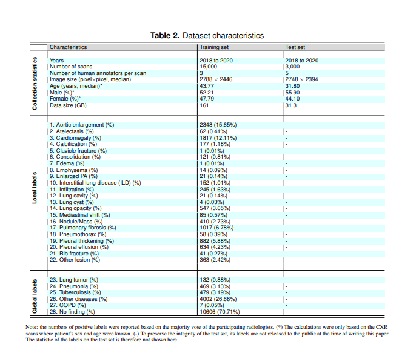

> In order to build a binary classifier, we will be only using the entries for training and test
> with Pneumonia Positive and No finding Positive respectively  
> To be more specific, we will filter out the global label that we want to retrieve
        eg. If we are getting Pneumonia 
            Then 
> COPD                  0
> Lung tumor	        0
> Pneumonia	        1
> Tuberculosis	        0
> Other diseases        0
> No finding            0 

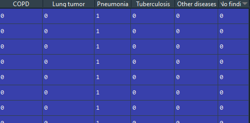

## Model used :

- ### Convolutional Neural Network

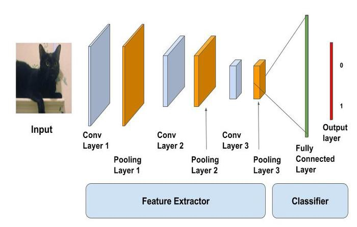

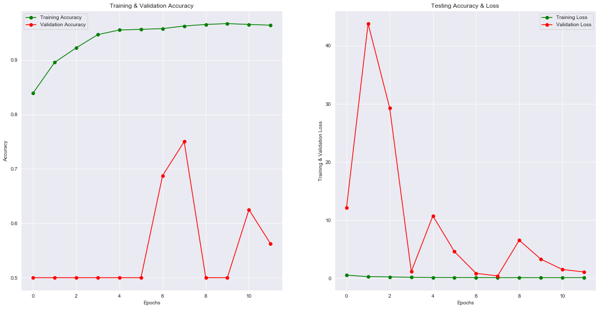

- ### Convolutional Neural Network(Different approach) :

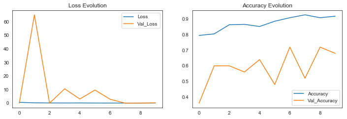

- ### DenseNet :

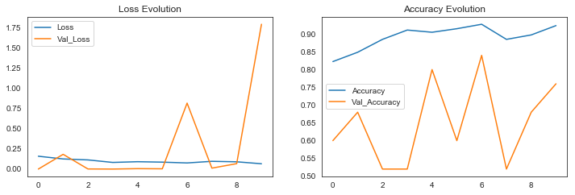

- ### VGG16 :

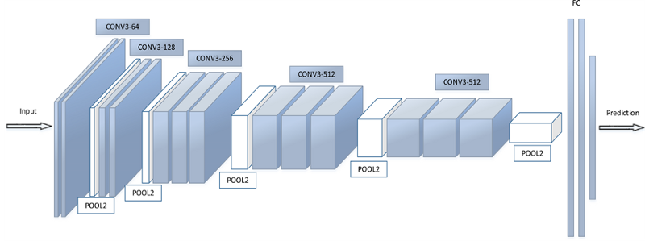

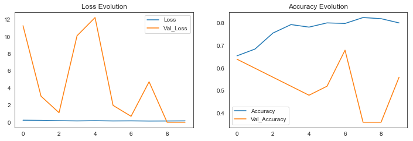

- ### ResNet :

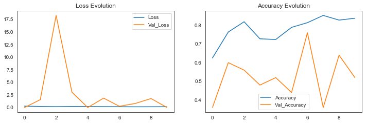

- ### InceptionNet :

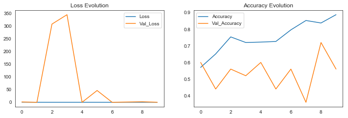

## LIME Explaination :

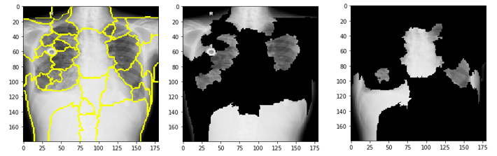

## Ground Truth Bounding Boxes :

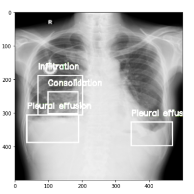

## Grad-Cam :

