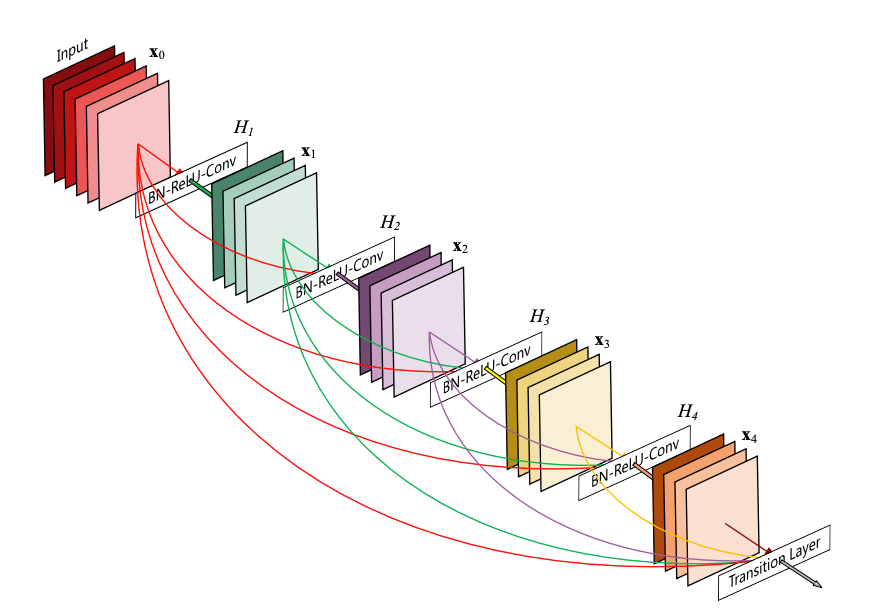

# PAKDD2022
26th Pacific-Asia Conference on Knowledge Discovery and Data Mining (PAKDD2022), which will be held in Chengdu, China on May 16-19, 2022.

# Pneumonia Detection using Deep Learning & explaination using LIME

## Problem Statement

**Build a binary classifier to detect pneumonia using chest x-rays.**

### Pneumonia
> Pneumonia is an infection that inflames the air sacs in one or both lungs. The air sacs may fill with fluid or pus (purulent material), causing cough with phlegm or pus, fever, chills, and difficulty breathing. A variety of organisms, including bacteria, viruses and fungi, can cause pneumonia.  Chest X-ray, blood tests, and culture of the sputum may help confirm the diagnosis. The disease may be classified by where it was acquired, such as community- or hospital-acquired or healthcare-associated pneumonia.

## Dataset description

> The dataset is organized into 3 folders (train, test, val) and contains subfolders for each image category (Pneumonia/Normal). There are 5,863 X-Ray images (JPEG) and 2 categories (Pneumonia/Normal).
Chest X-ray images (anterior-posterior) were selected from retrospective cohorts of pediatric patients of one to five years old from Guangzhou Women and Children’s Medical Center, Guangzhou. All chest X-ray imaging was performed as part of patients’ routine clinical care. For the analysis of chest x-ray images, all chest radiographs were initially screened for quality control by removing all low quality or unreadable scans. The diagnoses for the images were then graded by two expert physicians before being cleared for training the AI system. In order to account for any grading errors, the evaluation set was also checked by a third expert.

## Model used :

- ### Convolutional Neural Network

- ### Convolutional Neural Network(Different approach) :

- ### DenseNet :

- ### VGG16 :

- ### ResNet :

- ### InceptionNet :

## LIME Explaination :

## Ground Truth Bounding Boxes :

## Grad-Cam :

